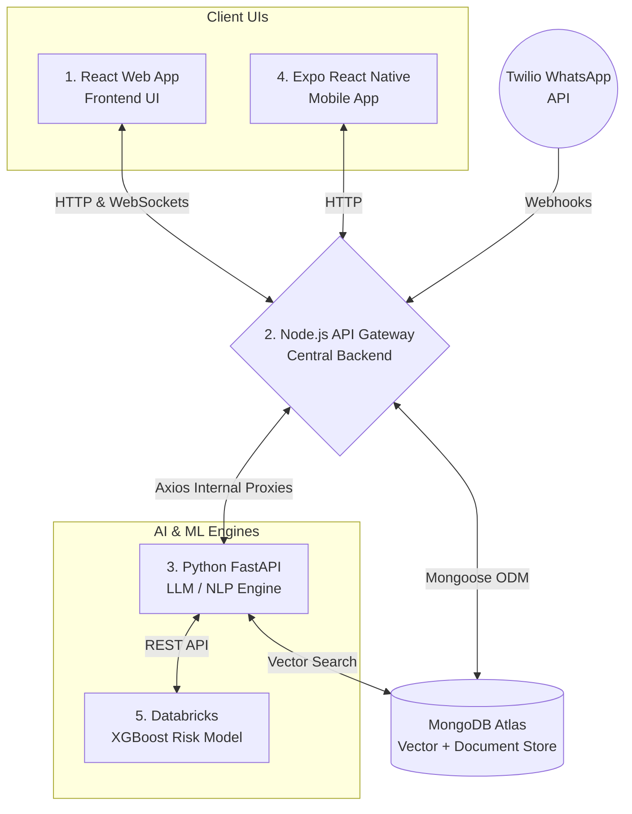

# CareConnect 🏥 — API Gateway & Central Orchestrator (Backend)

Welcome to the **CareConnect API Gateway**. This folder (Node.js/Express) is the undisputed core of the entire CareConnect platform. It acts as the "Traffic Cop" and central orchestrator for our **5-Pillar Microservices Architecture**.

---

## 🏗️ The 5-Pillar Architecture

CareConnect is distributed across five separate technological environments to maximize efficiency, security, and scalability. This API Gateway represents **Pillar 2**.



### Purpose of the Gateway
The UI (React/Mobile) **never** speaks directly to the Python AI engine or the Database. Every single interaction flows through this Node.js instance. This allows us to handle authentication, data validation, database persistence, and WebSocket real-time event broadcasting securely in one place.

---

## 🌊 Detailed Data Flows (How Things Work)

Below is the step-by-step breakdown of how data moves across the platform for our four core features.

### 1. Patient Vitals Ingestion (The Risk Pipeline)
**Trigger:** Patient uses the Mobile App to log their daily blood pressure and sugar.
1. **Intake:** Mobile pushes a `POST /api/data/vitals` to Node.js.
2. **Persistence:** Node.js saves the raw numbers into the MongoDB `VitalsLog` collection.
3. **Threshold Check:** Node checks if BP > 180 or Sugar > 300. If yes, it creates an `Alert` and fires a `critical_alert` WebSocket to the web app.
4. **Summary Generation:** Node proxies the vitals to Python (`/api/generate-summary`). Python passes it to LangChain, creating a Grade-6 readability summary, and returns it to Node.
5. **Score Recalculation:** Node proxies the updated profile to Python (`/api/predict-risk`). Python hits the Databricks ML endpoint to get the new % chance of readmission.
6. **Finalization:** Node updates the `Patient` document's `currentRiskScore` in Mongo, fires a `vitals_updated` WebSocket (so the dashboard flashes the new score), and returns the AI Summary to the Mobile App.

### 2. Ambient Dictation (The Push Tool)
**Trigger:** Doctor speaks into their phone to record clinical notes.
1. **Intake:** Text arrives at Node via `POST /api/data/dictation`.
2. **AI Processing:** Node immediately proxies the raw string to Python's `/api/extract-note` endpoint.
3. **Extraction & Embedding:** Python uses LangChain `with_structured_output` to pull `Symptoms`, `Actions`, and `Meds` strictly into JSON format. Simultaneously, it generates a 1536-dimensional vector embedding of the text.
4. **Persistence:** Node receives the JSON + Embedding and saves it as a `ClinicalNote` in MongoDB.
5. **Side-Effects:** If the AI found new medications, Node automatically pushes them into the `Patient.currentMedications` array.
6. **Real-time Refresh:** Node fires a `chart_updated` socket event so the Triage board on the React app auto-refreshes.

### 3. RAG Medical Copilot (The Pull Tool)
**Trigger:** Doctor asks: "Has this patient missed meds before?"
1. **Routing:** Request hits Node (`POST /api/data/copilot`), which proxies it to Python.
2. **Vectorization:** Python converts the question into an embedding.
3. **Atlas Vector Search:** Python queries MongoDB securely. **Crucial Privacy Guardrail:** The vector search pipeline includes a `$match: { patientId: X }` pre-filter so the LLM is physically incapable of hallucinating data from a different patient's chart.
4. **Reasoning:** The retrieved Top 5 chunks are stuffed into a strict "zero-hallucination" LangChain prompt.
5. **Response:** Python replies to Node, Node replies to the mobile app layout.

### 4. Automated Patient Loop (WhatsApp Webhooks)
**Trigger:** Patient replies "NO" to an automated SMS asking if they took their meds.
1. **Intake:** Twilio sends an HTTP POST Webhook to Node at `/api/webhooks/whatsapp`.
2. **Parsing:** Node strips the `whatsapp:+` prefix to identify the patient in MongoDB by phone number.
3. **Escalation:** Node creates an unresolved `Alert` object.
4. **Zero-Refresh UI:** Node fires a `critical_alert` WebSocket payload.
5. **Display:** The React Web App hears the socket ping and instantly injects a WhatsApp-styled chat bubble into the Escalation Center tab. Finally, Node returns an HTTP `200 OK` to Twilio so it stops retrying the webhook.

---

## 🧩 Database Schema Design (Mongoose)

All database validation actively happens in the `/models` directory using MongoDB's Object Data Modeling (ODM) library, Mongoose.

- **`Patient.js`**: The foundational identity. Tracks `currentRiskScore` (0-100) and an actively synced `currentMedications` array.
- **`VitalsLog.js`**: Time-series biometric data. Strongly indexed on `patientId` and `timestamp`.
- **`ClinicalNote.js`**: Replaces the EMR. Stores `rawText` directly alongside the parsed `extractedIntent` JSON object from LangChain.
- **`Alert.js`**: The escalation ledger. Tracks `alertType` (WhatsApp vs Critical_Vital) and a `resolved` boolean.

---

## 🛡️ Hackathon Reliability: The "Zero-Crash" AI Bridge

During live hackathon demos, external AI providers (OpenAI, Databricks) frequently rate-limit, timeout, or crash. 

To guarantee presentation success, we built the **AI Engine Bridge** (`services/aiEngineBridge.js`). Every internal Axios call from Node to Python is wrapped in a hard 10-second timeout. If the AI doesn't respond or throws an error, the catch block intercepts it and returns realistically structured **Mock Fallback Data**. 

Your Node.js hub will **never** crash, and the React UI will always render correctly, even if the building loses internet access.

---

## 🛠️ Folder Layout

```text
Backend/
├── config/                  # DB connection init
├── controllers/             # Core business logic for defining Data Flows
├── models/                  # Mongoose Schemas (Patient, Vitals, Notes, Alerts)
├── routes/                  # Express REST Endpoint mappers
├── scripts/
│   └── seed.js              # Injector script to populate MongoDB with demo entries
├── services/
│   └── aiEngineBridge.js    # Internal HTTP proxy client to the Python Server
├── .env                     # DB URIs and Ports
└── server.js                # Express App & Socket.io Hub
```

---

## 💻 Running the Gateway

1. Set up `.env`:
```env
PORT=5000
MONGO_URI=mongodb://127.0.0.1:27017/careconnect # Target your MongoDB instance
PYTHON_ENGINE_URL=http://localhost:8000
```
2. Install & Seed:
```bash
npm install
node scripts/seed.js  # Flushes DB and implants 3 realistic Hackathon patients
```
3. Start the Engine:
```bash
npm run dev
```
