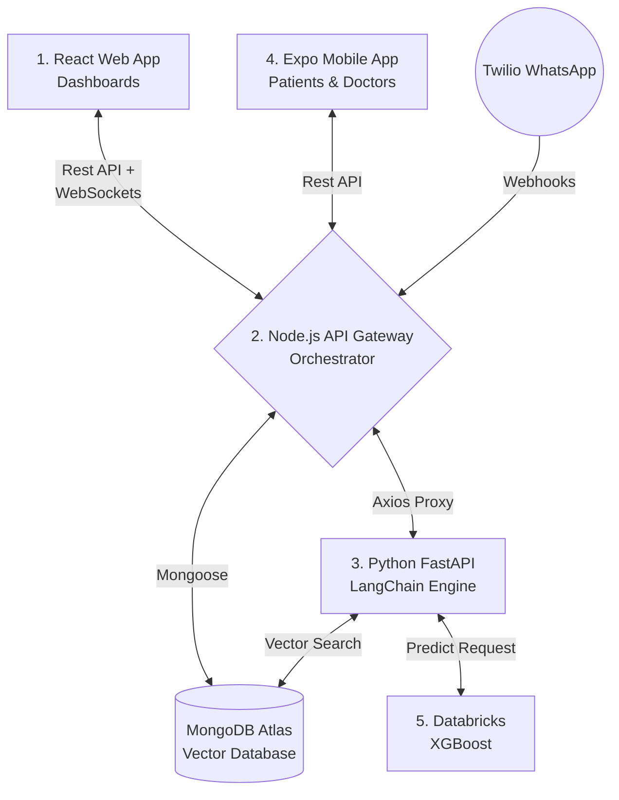

# 🏥 CareConnect 
**HackBricks 2026 | Built by Team Butter Garlic Naan 🧄🍞**

CareConnect is a premium, **Hybrid AI healthcare platform** designed to drastically reduce 30-day hospital readmissions through Predictive Risk Engines, Ambient AI documentation, and Automated Patient loop monitoring.

---

## 🛑 The Problem: The "Revolving Door"
Too many patients are sent home, only to get sick and return within 30 days. Current hospital software only looks at structured numbers, completely ignoring the written text in doctor's notes which holds the real clues. By the time older systems process the data, the patient has usually already left the building.

## 💡 The Solution: Multi-Modal Readmission Intelligence
CareConnect bridges the gap between acute clinical care and post-discharge recovery. We utilize a **5-Pillar Hybrid Architecture**—combining the mathematical power of Databricks Machine Learning (for precision risk scoring) with the contextual understanding of Large Language Models (for ambient clinical dictation and RAG summaries).

---

## 🏗️ The 5-Pillar Architecture Architecture

To guarantee strict separation of concerns, absolute data security, and parallel processing power, the platform is distributed across five environments.



### 📂 Directory Structure

We have built dedicated, highly-detailed `README.md` files inside **each** of these folders. Dive into them to understand the exact mechanics!

- `Frontend/` - Ultra-modern, OKLCH glassmorphism React 19 UI acting as the Clinical Hub.
- `Backend/` - Express + Node.js API Gateway. Central traffic cop powering all MongoDB schemas and Socket.io web socket alerts.
- `ai_engine/` - FastAPI LangChain server performing RAG secure isolation and dictation Pydantic extractions.
- `Mobile/` - React Native Expo Application utilized by both the patient at-home and the doctor in-ward.

*(Note: The 5th Pillar, Databricks, represents external cloud infrastructure called by the AI Engine via proxies).*

---

## 🔥 Key Technical Features

1. **Ambient Clinical Dictation:** Doctors simply speak into the Mobile App. The Python AI engine uses LangChain `.with_structured_output` to parse the chaotic voice text purely into JSON (`Symptoms`, `Medications`, `Actions`) completely automating documentation.
2. **Real-Time Websocket Triage:** The React Triage Board updates risk scores dynamically without refreshing. If a patient's vitals crash at home, the UI physically shifts their priority block.
3. **Automated Escalation Center:** Twilio hooks up to patient WhatsApps. If a patient ignores Meds, Twilio hits the backend, triggering an instant, injected Chat Bubble inside the React "Escalation Center".
4. **Sub-Second RAG Copilot:** Doctors can query massive EMR files conversationally. The search natively enforces `$match: patientId` at the Vector Search level, making cross-patient hallucination physically impossible.

---

## 💻 How to Boot the Platform Locally

To experience the entire platform, you must boot the microservices concurrently in separate terminal windows.

> [!TIP]
> **Zero Setup Database:** We've built an auto-seeder! In Terminal 2, simply run `node scripts/seed.js` to instantly flood your local MongoDB with all the patients, alerts, and vitals necessary for the hackathon demo.

### Terminal 1: Python AI Engine (Port 8000)
```bash
cd ai_engine
# (Ensure your venv is activated)
pip install -r requirements.txt
uvicorn main:app --reload --port 8000
```

### Terminal 2: Node.js API Gateway (Port 5000)
```bash
cd Backend
npm install
npm run dev
```

### Terminal 3: React Web Frontend (Port 5173)
```bash
cd Frontend
npm install
npm run dev
```

### Terminal 4: Expo Mobile App
```bash
cd Mobile
npm install
npx expo start
```
*(Scan the generated QR code using the Expo Go app on your physical iPhone/Android).*

---

### End-to-End Demo Ready
Once booted, use the Mobile app to dictate a note, watch it extract via Python, save via Node.js, and pop up on the React Triage Board instantaneously. Happy Hacking! 🧄🍞
